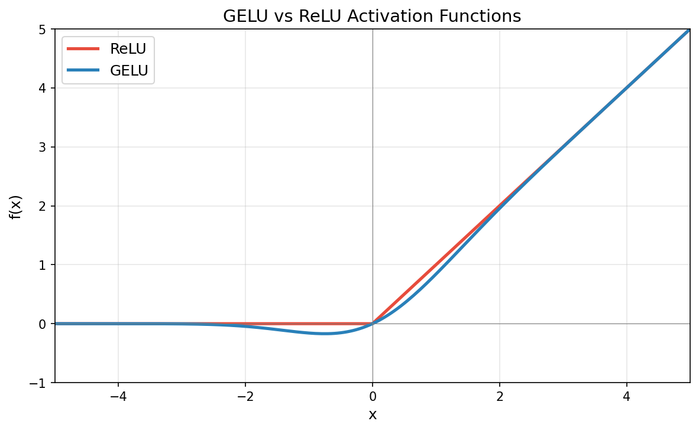

# Chapter 4: Implementing a GPT Model from Scratch

## GPT Architecture Overview

```
Input Token IDs: [The, cat, sat, on]
        │
        ▼
┌─────────────────────────────────┐
│  Token Embedding (vocab → d)    │  Look up learned vector for each token
│         +                       │
│  Position Embedding (pos → d)   │  Add position information
│         ↓                       │
│      Dropout                    │
└─────────────────────────────────┘
        │
        ▼
┌─────────────────────────────────┐
│     Transformer Block × N       │  (N=12 for GPT-2 Small)
│                                 │
│  ┌───────────────────────────┐  │
│  │ LayerNorm                 │  │  ← Pre-norm: normalize BEFORE attention
│  │ Multi-Head Attention      │  │  ← Causal mask (can't see future)
│  │ + Residual Connection     │  │  ← x + attn(norm(x))
│  ├───────────────────────────┤  │
│  │ LayerNorm                 │  │  ← Pre-norm: normalize BEFORE FF
│  │ FeedForward (GELU)        │  │  ← d → 4d → d
│  │ + Residual Connection     │  │  ← x + ff(norm(x))
│  └───────────────────────────┘  │
└─────────────────────────────────┘
        │
        ▼
┌─────────────────────────────────┐
│  Final LayerNorm                │
│  Linear Head (d → vocab_size)   │  → logits
└─────────────────────────────────┘
        │
        ▼
Output Logits: (batch, seq_len, vocab_size)
```

## Key Concepts

### Pre-norm vs Post-norm

| | Pre-norm (GPT-2) | Post-norm (Original Transformer) |
|---|---|---|
| **Order** | LayerNorm → Sublayer → Residual | Sublayer → Residual → LayerNorm |
| **Formula** | `x + sublayer(LN(x))` | `LN(x + sublayer(x))` |
| **Training** | More stable, easier to train deep models | Can be unstable without warmup |
| **Gradient flow** | Better — residual path is "clean" | Gradients pass through LayerNorm |
| **Used by** | GPT-2, GPT-3, LLaMA, most modern LLMs | Original Transformer, BERT |

**Why Pre-norm wins**: The residual connection `x + sublayer(LN(x))` creates an unimpeded gradient highway. The main path is never transformed by normalization, making optimization easier for very deep networks.

### Residual Connections

```
Input x ──────────────────┐
    │                     │ (skip / shortcut)
    ▼                     │
 [Sublayer]               │
    │                     │
    ▼                     │
  Output  ←───── (+) ─────┘
```

**Why they matter:**
- **Vanishing gradients**: In deep networks, gradients shrink exponentially as they flow backward. Residual connections provide a direct path for gradients.
- **Identity mapping**: If a layer learns nothing useful, it can default to identity (output ≈ 0) and just pass the input through.
- **Incremental learning**: Each layer only needs to learn the *residual* (the difference from the input), which is typically a smaller signal.

### GELU


 vs ReLU

```
```

| | ReLU | GELU |
|---|---|---|
| **Formula** | `max(0, x)` | `x · Φ(x)` where Φ is normal CDF |
| **At x=0** | Hard cutoff (not smooth) | Smooth transition |
| **Negative values** | Completely zeroed out | Small negative values allowed |
| **Problem** | "Dead neurons" (permanently zero) | No dead neuron problem |
| **Used by** | CNNs, older models | GPT-2, GPT-3, BERT |

**GELU intuition**: Instead of a hard gate (on/off), GELU acts as a *soft, probabilistic gate* — the probability of keeping a value is proportional to how large it is.

### Parameter Count (GPT-2 Small, 124M)

```
Component                          Parameters        Calculation
─────────────────────────────────────────────────────────────────
Token Embedding                    38,597,376        50,257 × 768
Position Embedding                    786,432         1,024 × 768
─────────────────────────────────────────────────────────────────
Per Transformer Block:              7,084,800
  ├─ LayerNorm ×2                       3,072        768 × 2 × 2
  ├─ MHA (Q, K, V, Out)            2,359,296        768 × 768 × 4
  └─ FeedForward (up + down)       4,722,432        768 × 3,072 × 2
                                                     (3,072 = 4 × 768)
× 12 blocks                       85,017,600
─────────────────────────────────────────────────────────────────
Final LayerNorm                         1,536        768 × 2
Output Head (no bias)              38,597,376        768 × 50,257
─────────────────────────────────────────────────────────────────
TOTAL (untied)                   ≈ 163,000,320
With weight tying*                ≈ 124,402,944
```

\* GPT-2 shares weights between the token embedding and output head, saving ~38.6M parameters. Our implementation keeps them separate for clarity.

## Files

| File | Description |
|------|-------------|
| `config.py` | GPT configuration dataclass (GPT-2 Small/Medium/Large/XL) |
| `gpt_model.py` | Complete model: LayerNorm, GELU, FeedForward, TransformerBlock, GPTModel |
| `generate.py` | Text generation: greedy decoding + top-k sampling with temperature |
| `demo.ipynb` | Interactive demo: instantiate model, forward pass, generate text |

## Quick Start

```python
from ch04.config import GPT2_SMALL
from ch04.gpt_model import GPTModel
from ch04.generate import generate_greedy, generate_topk
import torch

# Create model
model = GPTModel(GPT2_SMALL)
print(f"Parameters: {model.count_parameters():,}")

# Forward pass
idx = torch.randint(0, 50257, (1, 8))  # Random tokens
logits = model(idx)  # (1, 8, 50257)

# Generate (random weights → random output, just testing the pipeline)
generated = generate_greedy(model, idx, max_new_tokens=20)
```

## References

- 📖 Chapter 4 of "Build a Large Language Model (From Scratch)" by Sebastian Raschka
- 📄 [Language Models are Unsupervised Multitask Learners](https://cdn.openai.com/better-language-models/language_models_are_unsupervised_multitask_learners.pdf) (GPT-2 paper)
- 📄 [Gaussian Error Linear Units (GELUs)](https://arxiv.org/abs/1606.08415)
